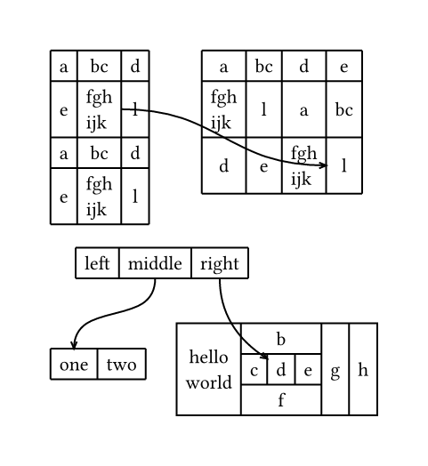

# typst-tabley

Basic experimental tables in CeTZ.

## Example

See [`example.typ`](./example.typ) for the source. But don't get too excited,
column and row spanning isn't really supported.

## What is this

This package is just a small attempt to see how feasible it is to create a CeTZ
based table package. I do not plan to work on this any further, but the hope is
that eventually [tablex](https://github.com/PgBiel/typst-tablex) will integrate
some sort of CeTZ renderer possibly reusing some of this code.
